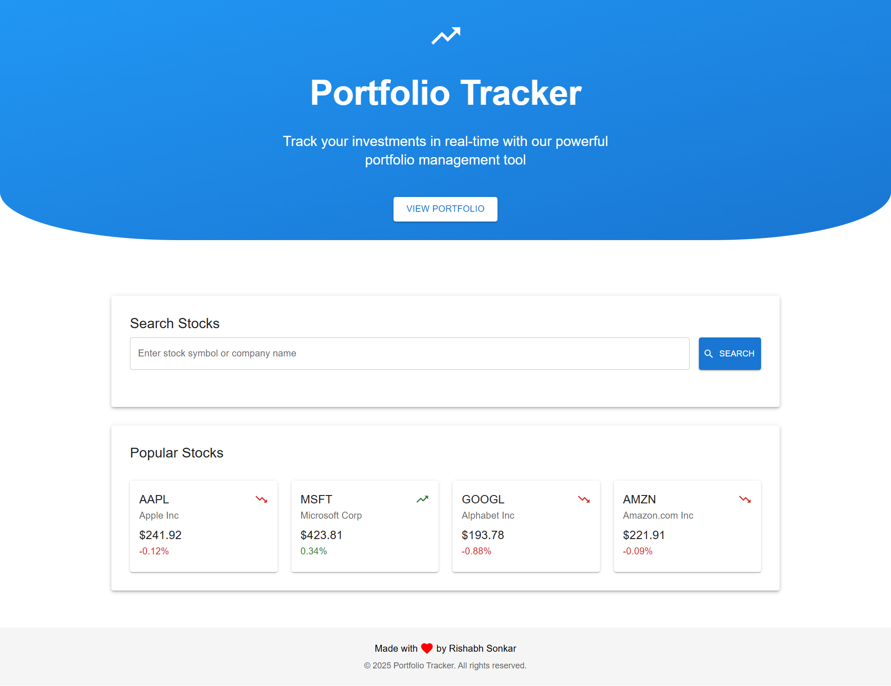
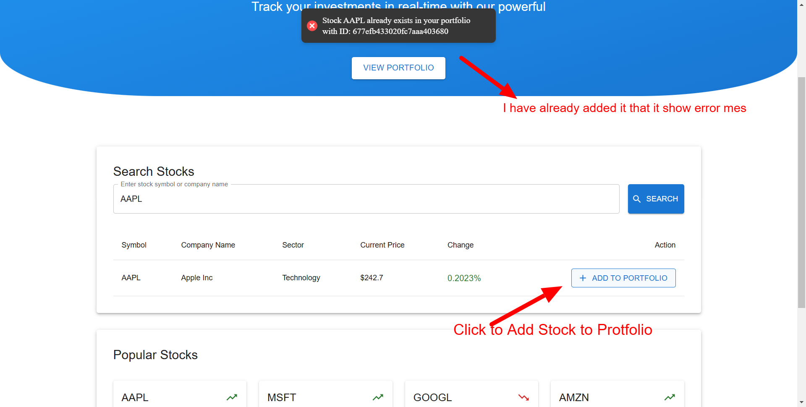
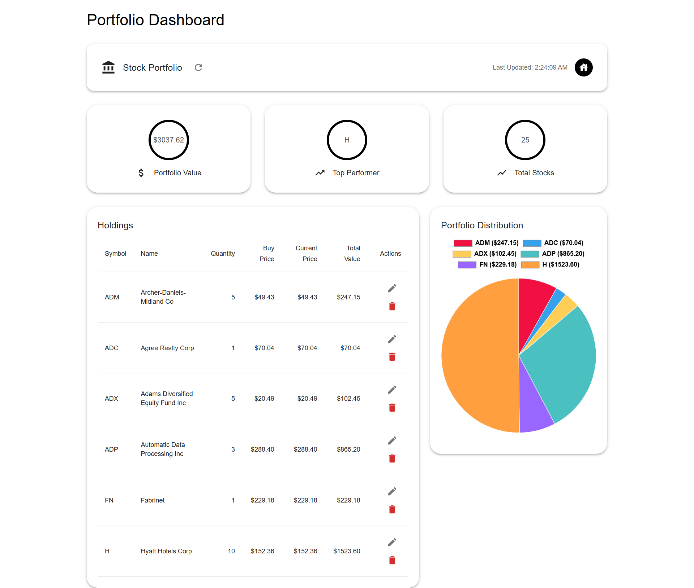
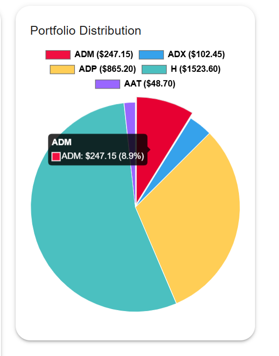
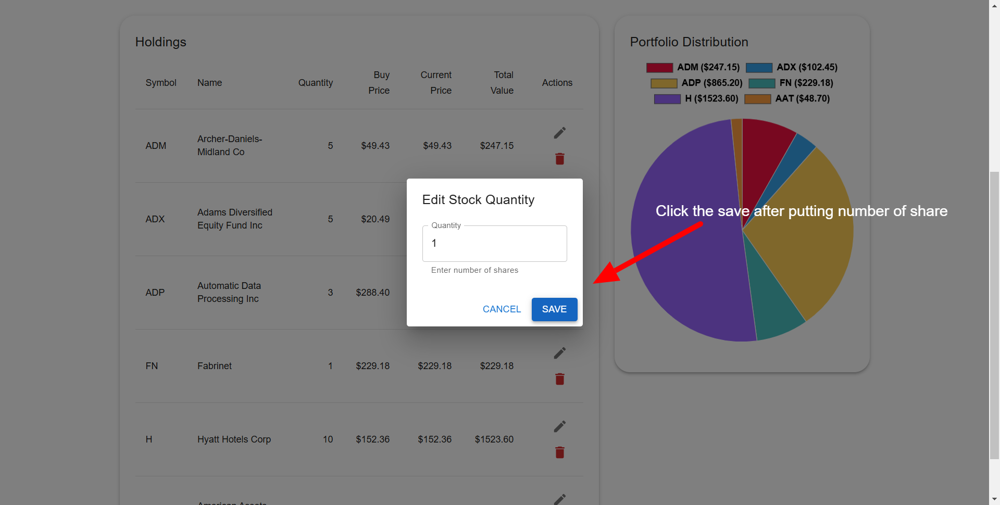

# Portfolio Tracker 📈
**🎉 This application has been deployed and is live! Check it out now**
### **[🌟 Click here to try the Live Demo! 🌟](Yourlivewebsite)**

A comprehensive portfolio tracker application enabling users to oversee their stock investments, retrieve real-time stock prices, and evaluate their portfolio's performance. Powered by a robust frontend and backend, the application seamlessly integrates portfolio management with stock price retrieval.

# Portfolio Tracker - Project Demo 🎥

Discover the user interface and capabilities of the **Portfolio Tracker** project! This video highlights the effortless workflow, including adding stocks, managing your portfolio, and visualizing your investment data.

# **Portfolio Tracker - Live Demo**  🎥 

🚀 **See the video of Portfolio Tracker in action!** 

---

<div align="center" style="border: 2px solid #FFD700; padding: 20px; border-radius: 10px; background-color: #FFFBEA;">
  <a href="https://www.awesomescreenshot.com/video/35336880?key=0d5b9aa665e3eab1d89c7319be9b0694" target="_blank">
    
  </a>
  <h2 style="color: #FF4500; margin-top: 15px;">
    👉 CLICK THE IMAGE TO WATCH THE VIDEO 👈
  </h2>
  <p style="font-size: 1.1rem; color: #333; margin-top: 10px;">
    <strong>Discover the intuitive interface, key features, and powerful tools in just a few minutes!</strong>
  </p>
</div>

---

🌟 **Why Watch This Demo?**
- Learn how to **add stocks** effortlessly to your portfolio.
- See how to **visualize your portfolio metrics** for better decision-making.
- Explore features like **real-time graphing**, **editing**, and **deleting stocks**. 

🔗 **Don’t miss out! [Watch the full video now.](https://www.awesomescreenshot.com/video/35336880?key=0d5b9aa665e3eab1d89c7319be9b0694)**  


## Features
- **Search**: Search for stocks by their ticker symbol.
- **Real-Time Top Trending Stocks**: Get real-time stock prices using the FinHub Stock API.
- **Add Stock**: Add a stock to your portfolio with details like name, ticker symbol, quantity, and buy price.
- **Dashboard**: View an overview of your portfolio with key metrics like total value and number of stocks.
- **Portfolio Management**: Add, update, fetch, and delete stocks in your portfolio.
- **Stock Price Integration**: Get real-time stock prices using the Finnhub Stock API.
- **Portfolio Value Calculation**: Calculate the total value of your portfolio based on the latest stock prices.

## Table of Contents

1. [Install Dependencies](#install-dependencies)
2. [Configuration](#configuration)
3. [Run the Application Locally](#run-the-application-locally)
4. [API Documentation](#api-documentation)
5. [Deployment Links](#deployment-links)
6. [Contributing](#contributing)
7. [License](#license)

## Install Dependencies

**This Project follow MVC pattern to setup Follow the steps below to set up the application locally.**
To get started with the application, you'll need to install the necessary dependencies for both the frontend and backend. Follow the steps below to set up the application locally .

### Frontend Setup:

1. Navigate to the `frontend` directory:
    ```bash
    cd frontend
    ```

2. Install the dependencies:
    ```bash
    npm install
    ```

### Backend Setup:

1. Navigate to the `backend` directory:
    ```bash
    cd backend
    ```

2. Install the dependencies:
    ```bash
    npm install
    ```

## Configuration

### MongoDB Setup:

- Add your MongoDB connection string to the `.env` file for backend setup.
- sample `.env` file:
    ```bash
    MONGO_URI = mongodb://localhost:27017/portfolio-tracker
    ```

### API Keys and Environment Variables Setup:

- Add necessary environment variables to `.env` files for both the frontend and backend, such as database credentials and API keys.

- You will need an API key from [FinHub Stock API](https://finnhub.io/) to fetch stock prices.
- Sign up for a free account and get your API key.

- Add the API key to the `.env` file for frontened setup.
- sample `frontened .env` file:
    ```bash
    VITE_SERVER_URL=YOUR_SERVER_URL
    VITE_FINHUB_API_KEY = YOUR_FINHUB_API_KEY
    VITE_FINHUB_BASE_URL = https://finnhub.io/api/v1
    ```


## Run the Application Locally

### Frontend:
To start the frontend, run the following commands:

```bash
cd frontend
npm start || npm run dev

```

### Backend:
To start the backend, run the following commands:

```bash
cd backend
npm start ||  node index.js
```

## 🚀 API Documentation

Explore the complete and interactive API documentation through the live link below to understand the endpoints, request parameters, and responses:
- GET/POST/PUT/DELETE requests for managing stocks in the portfolio.
- Real-time stock price retrieval using the FinHub Stock API.
- Portfolio value calculation based on the latest stock prices.
- /my,getstocks - Get all stocks in the portfolio
- /:id,addStock - Add a stock to the portfolio
- /:id,updatestock - Update a stock in the portfolio
- /id,deleteStock - Delete a stock from the portfolio
- /stats,getPortfolioStats - Get portfolio statistics like total value and number of stocks 


### 📄 API Functionality Overview

## ⚠️ Assumptions and Limitations

Please note the following assumptions and limitations for the demo version of the CapX application:

1. **One Stock Only**: For demo purposes, you can add only one stock, with a quantity set to 1. This is to keep the demo simple and focused on showcasing core functionality.
  
2. **No Authentication**: As per the Task assigned the application currently supports only one user and does not include authentication. This is solely for demo purposes, and user management will be implemented in future versions.

3. **Simplified UI**: The user interface is intentionally kept simple and clear to provide a better understanding of the functionality. A more visually attractive design will be added later without compromising usability.

We appreciate your understanding as we continue to enhance the platform! 🚀


## 🎨 User Interface Walkthrough

Below is a step-by-step guide to navigating through the main features of the **Portfolio Tracker** application, with accompanying visuals to help you understand the workflow.

---

### 1️⃣ **Main Interface**

The home page presents a clean and intuitive interface with several key components:

- **Search Bar**: Located at the top, allowing quick stock lookups
- **Top Trending Stocks**: Real-time display of popular stocks and their current prices
- **Portfolio Summary**: Quick overview showing:
  - Total Portfolio Value
  - Number of Stocks
  - Profit/Loss Overview
- **Quick Actions**:
  - Add Stock Button
  - Portfolio Management Tools
- **Interactive Chart**: Visual representation of portfolio performance
- **Recent Activity**: Latest updates and transactions in your portfolio

<div align="center">
  
</div>
---

### 2️⃣ **Adding a Stock**
To add a stock:
- Click the "Add Stock" button.
- Enter the stock details, including **name**, **ticker symbol**, **quantity**, and **buy price**.
- Click **Add to Portfolio** to add the stock to your portfolio.

<div align="center">
  
</div>

---

### 3️⃣ **Dashboard and Portfolio Metrics**
Once stocks are added, the dashboard displays a summary of your portfolio with key metrics like **total value**, **number of stocks**, and their current market value.

<div align="center">
  
</div>

---

### 4️⃣ **Graphical Analysis**
Analyze your portfolio's performance over time with interactive graphs. The graph provides insights into trends and allows for better investment decision-making.

<div align="center">
  
</div>

---

### 5️⃣ **Viewing Portfolio Stocks**
The detailed portfolio section lists all stocks, including their **name**, **ticker**, **quantity**, **buy price**, and **current market price**.

---

### 6️⃣ **Edit and Delete Functionality**
- **Edit**: Modify stock details (e.g., quantity or buy price) to keep your portfolio updated.
- **Delete**: Remove unwanted stocks from your portfolio with a single click.

<div align="center">
  
</div>

---

### 📋 **Steps to Use the Application**
1. **Navigate to the Main Interface**: Begin at the main dashboard to get an overview of your portfolio.
2. **Add a Stock**: Use the "Add Stock" feature to include new investments in your portfolio.
3. **View Portfolio Metrics**: Access the dashboard to track your portfolio's total value and individual stock details.
4. **Analyze Performance**: Use the graphical insights for performance trends and predictions.
5. **Edit or Delete**: Modify stock details or remove stocks as necessary to maintain accuracy.

---

This guide ensures a smooth user experience while utilizing all the features of the Portfolio Tracker app. Explore and make the most of your investments!


